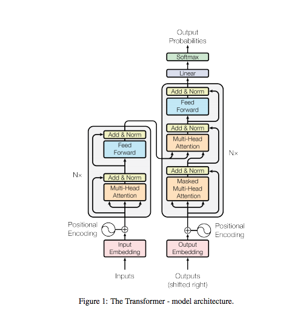

# A Pytorch Implementation of [Transformer](https://arxiv.org/pdf/1706.03762)

## Model Architecture

### Positional Encoding

### Scaled Dot-Product Attention

### Multi-Head Attention

### Position-wise Feed-Forward Networks

### Layer Norm

## Experiments
### Tokenize
Using [SpaCy](https://spacy.io/usage/) to tokenize languages for wmt32k
dataset. 
```
$ pip install spacy
$ python -m spacy download en
$ python -m spacy download de
```
### Dataset
Use [Multi30K](https://arxiv.org/abs/1605.00459)  Dataset to train and evaluate model <br>

### configuration
* batch_size = 128
* max_len = 256
* d_model = 512
* n_layers = 6
* n_heads = 8
* ffn_hidden = 2048
* drop_prob = 0.1
* init_lr = 0.1
* factor = 0.9
* patience = 10
* warmup = 100
* adam_eps = 5e-9
* epoch = 1000
* clip = 1
* weight_decay = 5e-4
<br><br>

## Usage

#### Train Model
```
python train.py
```

#### Test Model
```
python test.py
```

## Requirements
* Python == 3.8.9
* torch == 1.9.1
* tensorboard == 2.12.0
* torchtext == 0.10.1
* torchdata == 0.7.1


